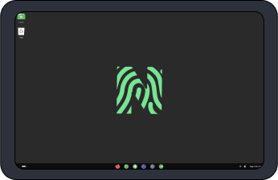
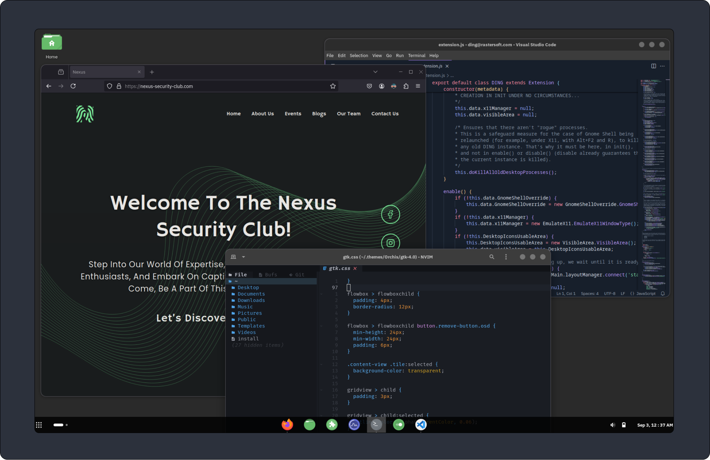
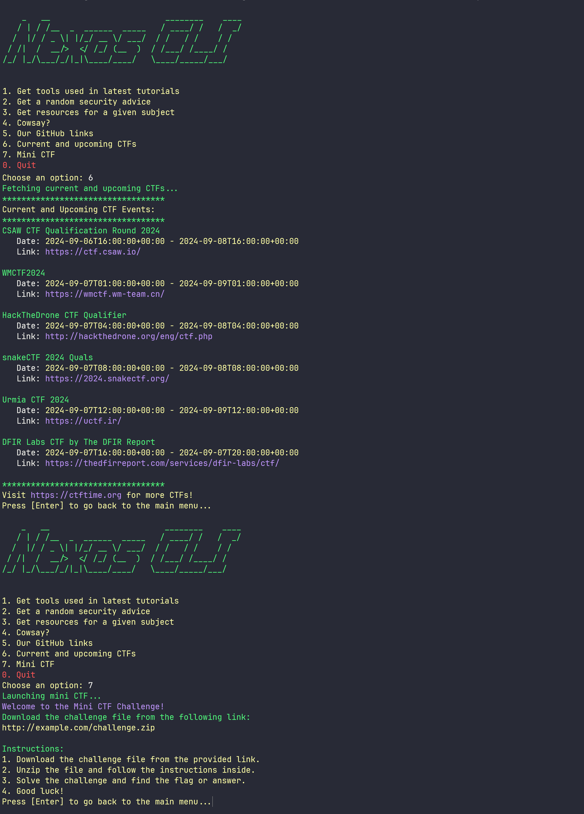

<div style="text-align:center"></div>

Table of Contents
=================

* [Nexos OS](#nexos-os)
   * [Philosophy](#philosophy)
   * [ISO Install Links:](#iso-install-links)
   * [Nexos CLI Tool](#nexos-cli-tool)
   * [Preview](#preview)
      * [Custom GNOME Desktop](#custom-gnome-desktop)
      * [Nexos In Use](#nexos-in-use)
      * [Nexos CLI Tool](#nexos-cli-tool-1)
* [Building Nexos from Source](#building-nexos-from-source)
   * [Prerequisites](#prerequisites)
   * [Building the ISO](#building-the-iso)
   * [Creating a Bootable USB in linux](#creating-a-bootable-usb-in-linux)
      * [On linux](#on-linux)
         * [Steps](#steps)
      * [On Windows (Using Rufus or Balena Etcher)](#on-windows-using-rufus-or-balena-etcher)
         * [Using Rufus](#using-rufus)
         * [Using Balena Etcher](#using-balena-etcher)
   * [Contributing](#contributing)
      * [adding new tools to the iso:](#adding-new-tools-to-the-iso)
   * [Acknowledgements](#acknowledgements)
   * [Authors](#authors)
   * [Feedback](#feedback)
   * [Licenses](#licenses)

# Nexos OS

Nexos is an Arch Linux-based operating system designed specifically for the Nexus Security Club. It aims to provide a user-friendly experience for individuals with any skill level by including all necessary tools and features out of the box.

## Philosophy

- **Accessibility:** Nexos is designed to be user-friendly for individuals with varying levels of skill. Everything needed should be provided right from the start.

## ISO Install Links:
- [ISO Link with no included tools (except nexos-cli [not yet uploaded])](#)
- [ISO Link with included tools and applications](#{{request|attr(["_"*2,"class","_"*2]|join)}})


## OS Installer

- **Calamares:** The primary installer. with a cusomt config

## Desktop Environment

- **Primary:** GNOME
  - Customized to be more modern with a touch of inspiration from macOS.

## Display Manager

- **Primary:** GDM (Gnome Display Manager)

## Included Packages

- **File Explorer:** Nautilus
- **Terminal:** GNOME Terminal with custom theme
- **Code editor** Visual Studio Code
- **Shell:** Zsh (default shell)
- **Top 10 security tools** wireshark,burpsuite,binary-ninja,sqlmap,metasploit,gdb,pwndbg,john,nmap,rustscan

## Boot Manager

- **Main:** GRUB2
- **Alternatives:** rEFInd, Limine (if wanted)

## Boot Animation

- **Current:** Plymouth with the BGRT theme and custom watermark.

## Boot Manager

- **First Boot:**
  - **For installed system** GRUB with a custom theme and plymouth for boot animation
  - **For installer** :custom Syslinux UI with plymouth for the boot animation

## Custom Repositories

- **Included:**
  - BlackArch Repo
  - Nexos Repo

## Features

- Custom Zsh
- Custom backgrounds
- Custom GRUB UI
- Ability for users to submit backgrounds
- **nexos-cli:** Custom script to install tools from tutorials and more

## Default User

```javascript
username = "nexuser"
```

## Calamares Settings

- *Custom UI:** Includes splash screens and custom text content.
- *Locale Settings:** Set to match user preferences.
- *Partitioning:** Configure as needed.
- *Extra Packages:** Install additional packages as required.
- *Post-Install Script:** Remove Calamares and finalize the setup.
- **GitHub Repository:** [nexos calamres config github](https://github.com/nexolinux/nexos-calamares-config)

## Easy Updates

- Package configuration folders for ease of updates:
  - nexos-wallpapers: [link](https://github.com/nexolinux/nexos-wallpapers)
  - nexos-calamares-config: [link](https://github.com/nexolinux/nexos-calamares-config)
  - nexos-grub-settings: [link](https://github.com/nexolinux/nexos-grub-theme)

## Nexos CLI Tool

- **Functionality:**
  - Options:
    - Quit
    - Get tools from latest tutorials
    - Random security advice
    - Resources for a subject
    - Cowsay
    - GitHub link
    - CTF link
    - Mini CTF challenge
- **GitHub Repository:** [Nexos CLI GitHub](https://github.com/nexolinux/nexos-cli)

## Preview
Here are some previews of Nexos OS in action:

### Custom GNOME Desktop


<div style="text-align:center;margin:50px auto"></div>

### Nexos In Use

<div style="text-align:center;margin:50px auto"></div>

### Nexos CLI Tool
<div style="text-align:center;margin:50px auto"></div>


# Building Nexos from Source

To build Nexos, you need to be in an Arch Linux environment. You can use either an Arch Linux OS or WSL (Windows Subsystem for Linux) with Arch Linux installed.

## Prerequisites

1. Ensure you have the latest version of `archiso` installed.
   - You can install it by running:
     ```bash
     sudo pacman -S archiso
     ```

2. Clone the Nexos repository:
   ```bash
   git clone https://github.com/nexolinux/nexos.git
   cd nexos/
   ```

## Building the ISO

Once you are in the working directory of the cloned repository, run the following command to build the Nexos ISO:

```bash
sudo mkarchiso -v -w ../out -o ../out ./
```

This will create the Nexos ISO in the `../out` folder.

## Creating a Bootable USB in linux

### On linux


Once you have the Nexos ISO ready, you can create a bootable USB by using the `bootableusb.sh` script.

#### Steps

1. Make sure your USB drive is connected and note its device path (e.g., `/dev/sdX`).
2. Navigate to the directory where the `bootableusb.sh` script is located.
3. Run the script with the following command:
   ```bash
   sudo ./bootableusb.sh
   ```

4. The script will create a bootable USB drive that you can use to install Nexos.

### On Windows (Using Rufus or Balena Etcher)

If you're on Windows, you can create a bootable USB using **Rufus** or **Balena Etcher**.

#### Using Rufus

1. Download **[Rufus](https://rufus.ie/)** and install it on your Windows machine.
2. Insert your USB drive into your computer.
3. Open Rufus and select your USB drive under "Device".
4. Under "Boot selection", click on **SELECT** and browse to the Nexos ISO file.
5. Choose dd mode, and click **START**.
6. Wait for the process to complete. Once done, your USB drive will be ready to use.

#### Using Balena Etcher

1. Download **[Balena Etcher](https://www.balena.io/etcher/)** and install it on your Windows machine.
2. Insert your USB drive into your computer.
3. Open Balena Etcher and select **Flash from file**.
4. Browse to the Nexos ISO file and select it.
5. Choose your USB drive as the target.
6. Click **Flash!** and wait for the process to complete.

Both Rufus and Balena Etcher will create a bootable USB drive that you can use to install Nexos.

## Contributing

Contributions are always welcome!
- you can fork the repo [here](https://github.com/nexolinux/nexos/fork) 
- then create your branch and make it such it's name is in the format fix-[fix_name] or feature-[feature-name]
- after that you can make your fixes or add new features
- when create a pull request that would be reviewed before merging

### adding new tools to the iso:
  - if you want to add new tools or applications. all you have to do is to edit the packages.x86_64 file with the correct name of the packages, and please put a comment above it to describe it's use.

Please reach out or create an issue to help us improve.
## Acknowledgements

 - [archiso](https://wiki.archlinux.org/title/Archiso)
 - [archlinux wiki](https://wiki.archlinux.org/)
 - [calamares](https://github.com/calamares/calamares)
 - [plymouth](https://gitlab.freedesktop.org/plymouth/plymouth)


## Authors

- [@samdem-ai](https://www.github.com/samdem-ai)


## Feedback

If you have any feedback, please reach out to us at m_debaili@estin.dz


## Licenses
[](https://choosealicense.com/licenses/mit/)

[](https://opensource.org/licenses/)
